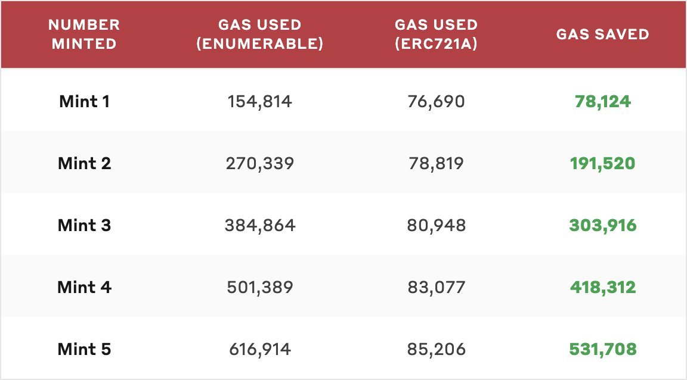

# NFT Minting

Total NFT Supply : Limited Quantity at **5,000**

| Minting Phases    | Mint Price | Quantity | Mint Date  |
| ----------------- | ---------- | -------- | ---------- |
| 1st Minting Phase | 0.10 Eth   | 1,000    | April 2022 |
| 2nd Minting Phase | 0.15 Eth   | 2,000    | TBC        |
| 3rd Minting Phase | 0.20 Eth   | 2,000    | TBC        |

 (1).png>)

_****_

To ensure the quality of the community, minting priority is given to whitelist candidates. There will be no public mint if all whitelist spots are taken. However, the public can still join our whitelist by completing the tasks listed in [How to Get Whitelist](how-to-get-whitelist.md).

## **ERC721A**

To enhance the minting experience, AMDC has implemented the latest NFT smart contract standard - **** ERC721A&#x20;

It is a new implementation of IERC721 with significant **gas savings** for minting multiple NFTs in a single transaction.

