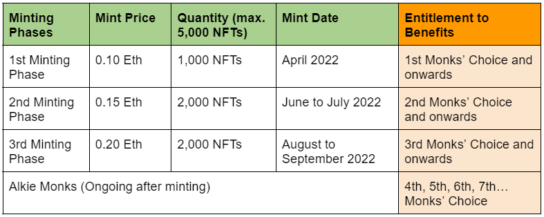
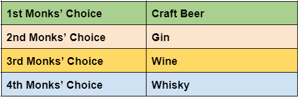

# What is Monk's Choice?

&#x20;“Monks’ Choice” are AMDC **exclusive products** which are:

* **Elected** by Alkie Monks,
* **Made** for Alkie Monks,
* **Owned** by Alkie Monks, and
* **Labelled** with Alkie Monks’ **NFT**

**ALL** NFT holders are eligible for claiming the Monks’ Choice exclusive products. For each minting phase, one set of Monks’ Choice product is made and decided by Alkie Monks as a guaranteed benefit for each phase. Alkie Monks who join the community in an earlier phase will still be eligible for the future Monks’ Choice redemption. Therefore, the earlier you become an Alkie Monk, the more benefits you are entitled; plus the lower mint price you need to pay to enjoy AMDC benefits. The table below explains the benefit entitlement of each minting phase:

#### There are 4 exclusive products planned to be made so far in our roadmap. They are:

