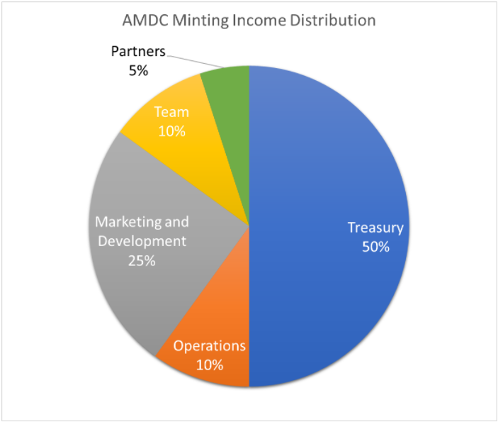

# Treasury

### AMDC vs. Other NFT Projects

**Most NFT projects** are simply selling collectibles. Holders own the digital artworks authorised by the artist on blockchain as a unique, non-fungible token with limited rights and usage. Sometimes the NFT projects may come with benefits, such as whitelist opportunities for next NFT projects or early access to the metaverse (if any), or one-off souvenirs given to holders as gifts. Organiser/artists usually don’t grant additional benefits to holders to make the project sustainable. Also, almost all NFT sale goes to organiser/artist. Once the hype is gone, the NFT value will fall because there is little demand from the market.

.png>)

In order to make AMDC a **sustainable**, **long-lasting** community, AMDC is structured as a self-sufficient ecosystem after minting phases. \
**50% of the income from the NFT sale becomes the treasury** of AMDC for event organisation and exclusive item production; i.e. income is distributed back to Alkie Monks in the form of events and products.

This approach will help **increase the NFT value and demand** by enriching its utilities through exclusive events and products. Subject to market and members’ feedback, extra exclusive products will also be produced and released in the public market for sale. Profits generated from the public sale will be contributed to AMDC treasury for exclusive events and production in the future.

Allowing treasury to be used for potential income sources enables AMDC to form its own income cycle to maintain the group’s operations and ensure continuous benefits to be provided to Alkie Monks from the treasury. Treasury wallet address will be shared after the 1st Phase Minting.
