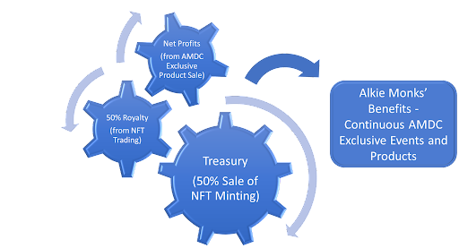

# Ecosystem

### How does the Ecosystem work?

50% income from the NFT sale automatically becomes the treasury of AMDC. The treasury is **solely** used for members’ benefits and members’ related functions/activities:&#x20;

1. Organisation of AMDC exclusive events&#x20;
2. Monks’ Choice production
3. Purchase of any special items from the market to benefit Alkie Monks (based on community’s decision)

To maintain a **long-lasting** and **healthy community**, continuous activities and benefits need to be provided to Alkie Monks. But continuous spending will use up the treasury one day. Thus ongoing, sustainable income is necessary to ensure there is sufficient fund in the treasury to run future activities.&#x20;

### Treasury Income

One way to generate income is to **sell AMDC’s exclusive products to the public**. Net profit made from the public sale will be allocated to the treasury:

.png>)

Another way to generate income is from **royalty**. 50% of royalty earned from the secondary market sale (for both ERC-721A and ERC-1155) will be allocated to the treasury.

Subject to the size of the treasury, **investing/acquiring** other alcoholic beverage companies and/or related business will also be a possible option to expand AMDC's footprint in the industry. At the same time any profits generated from the investment will be an income source to AMDC.&#x20;
